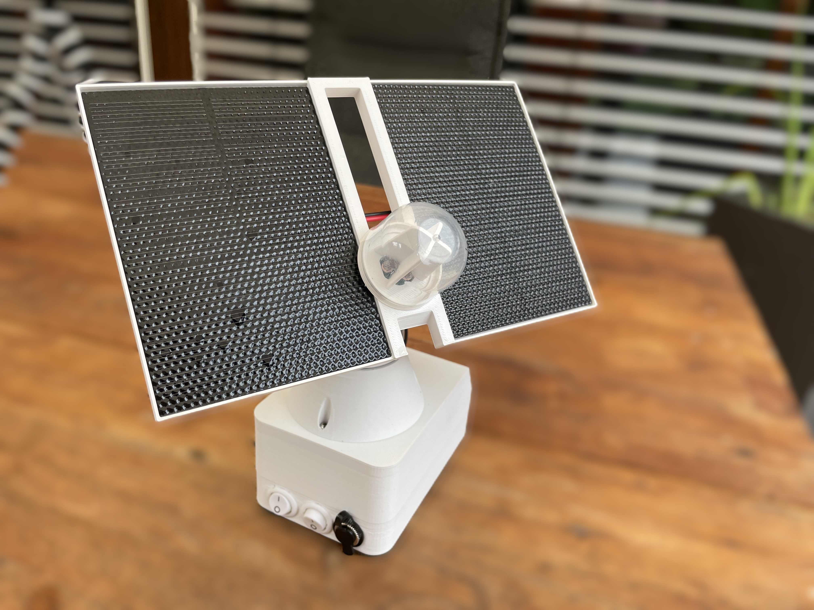
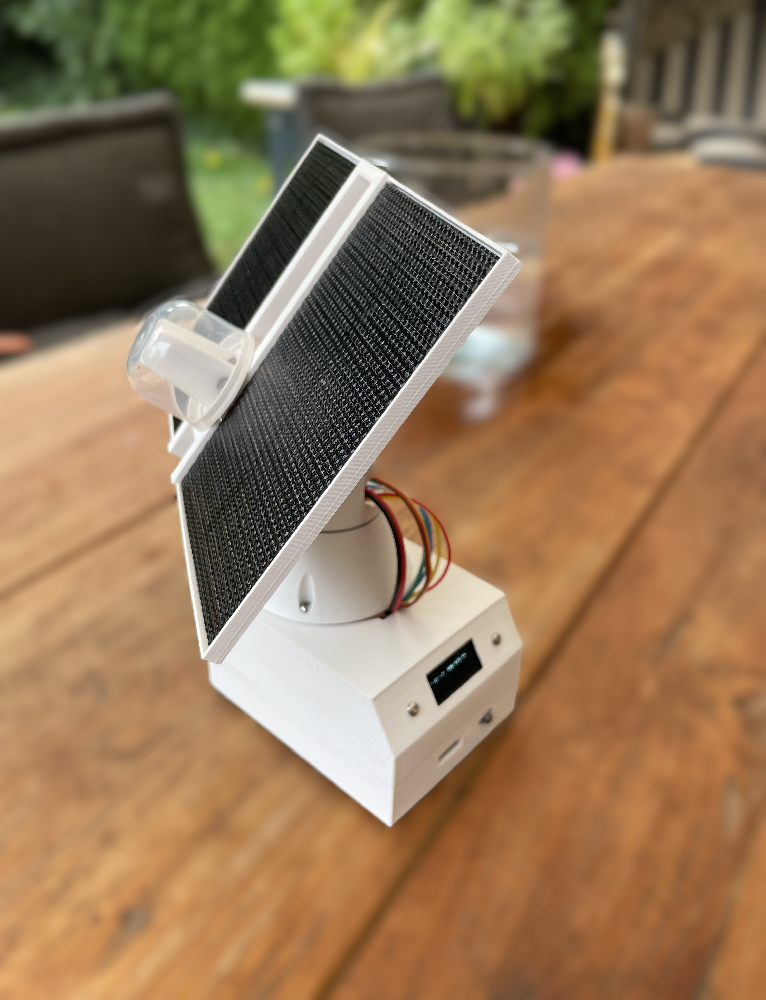

# SolarTracker from Zachi Zolar
## Introduction

This repository contains all necessary information to rebuilt a little solar tracker with 2x1W solar panels, which produces enough power to drive itself and, if the sun light is bright enough, a little garden fontain (1.4W).
The project is supposed as a starting point for Arduino enthusiast to create a funny little device and learn to bring all skills together, such as: 
* Programming Arduino Nano
* CAD
* PCB's and soldering
* 3D printing
* crimping wires and connections
* to overcome frustration
* to learn to pursue a goal patiently and persistently

The SolarTracker v1.0 from Zachi Zolar is far away from being ready. E.g. the first version was melting in the sun because it was 3D printed with PLA. This version printed with ASA withstands UV light and heat, 
but it is not really water protected.
Happy assembling!

A little [introduction](https://www.youtube.com/watch?v=XpIjK1iY8B4&t=24s) video in German on Youtube.
